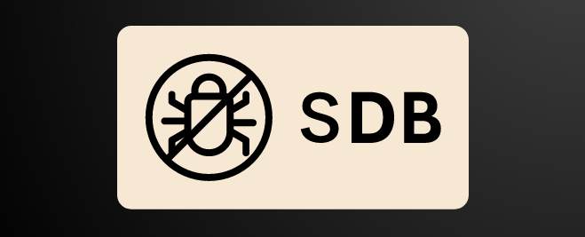

    

<h1 align="center">SDB</h1>

sdb is a tool greatly inspired by gdb, made in C to experiment with debuggings tools and understand how debugging works at the low-level.

    
    
     
    

## Usage

todo

## Installation

todo

## Roadmap

- [ ] Understand how debugging works
- [ ] Define the requirements and features of the debugger
- [ ] Design and implement the command-line interface (CLI)
    - [ ] Take a look at [argtable](https://www.argtable.org/)
- [ ] Create functionality for setting breakpoints and stepping through code
- [ ] Implement error handling and debugging features
- [ ] Test and refine the debugger to ensure its functionality